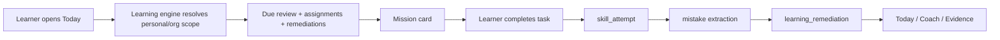
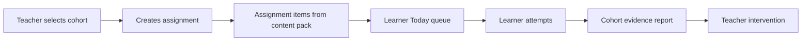
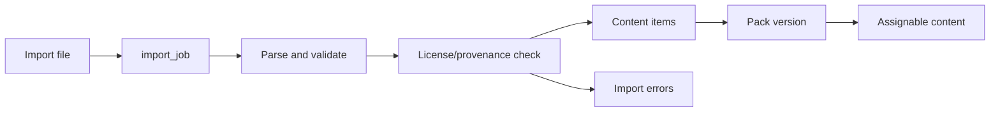

# Open-Core Enterprise Learning OS Design

Date: 2026-07-08
Status: Proposed design for review
Scope: Product, functional architecture, UI direction, open-core/commercial boundary, enterprise SaaS readiness
Target repo: `/Users/yang/projects/app`

## Executive Summary

VocabDaily can become an open-core, commercially licensed enterprise learning SaaS, but it is not enterprise-ready today. The current product already has the right learning spine: vocabulary, FSRS-style review, Today missions, Coach surfaces, practice, reading, listening, writing, pronunciation, analytics, Supabase Auth/RLS foundations, and fail-closed billing work. The missing layer is not another study mode. The missing layer is enterprise-grade proof, tenancy, authorization, content provenance, and teacher/admin workflows.

The recommended direction is **Open-Core Enterprise Learning OS**:

- Open-source core: personal learning workbench, FSRS/review loop, basic content import/export, core learning evidence model, Supabase self-host schema, basic AI fallback patterns, and contribution docs.
- Commercial enterprise layer: hosted SaaS, organizations, seats, RBAC, cohorts, assignments, enterprise evidence reports, advanced AI quotas, paid content packs, audit logs, SSO/SCIM, SLA, and contract billing.

The product should sell three things to schools, training organizations, and companies:

1. Learners get the next best action every day.
2. Teachers/managers get trustworthy evidence of progress.
3. Organizations get safe operations: seats, permissions, audit, billing, data controls, and content licensing.

The first implementation phase should not start with SSO or procurement features. It should start with a small but real enterprise spine: organization membership, cohort assignments, unified learning attempts, remediation routing, content/license manifests, and an enterprise workbench UI.

## Inputs Reviewed

This design is based on repo inspection, current UI screenshots, and parallel agent analysis across learning flows, enterprise SaaS readiness, and UI/design system direction.

Primary project evidence:

- `README.md`: VocabDaily AI scope, Vercel + Supabase split, AI tutor, FSRS review, PWA, release/deploy assumptions.
- `package.json`: Vite, React 19, Supabase, React Query, Router, Tailwind, Radix, Recharts, Framer Motion, test/build scripts.
- `src/App.tsx`: current public/dashboard route surface.
- `src/features/learning/routeRegistry.ts`: current dashboard IA registry and nav groups.
- `src/services/learningEngine.ts`: Today mission card generation.
- `src/features/learning/dailyCoachPlan.ts`: Daily Coach plan contract.
- `src/services/evidenceEvents.ts`: current evidence event model.
- `src/services/learnerModel.ts`: local learner model and personalization.
- `src/features/practice/recommendedMode.ts`: practice mode recommendation.
- `src/features/learning/learningPathRouting.ts`: lesson-to-route action mapping.
- `src/features/lexicon/lexicalEntry.ts`: lexicon adapter and IELTS relevance fields.
- `src/pages/dashboard/VocabularyBankPage.tsx`: current vocabulary/content page.
- `src/services/billingGateway.ts`: server billing gateway plus legacy local subscription mock.
- `src/features/marketing/pricingAvailability.ts`: fail-closed pricing availability gate.
- `src/lib/supabase.ts` and `api/supabase.js`: Supabase client/proxy behavior.
- `supabase/migrations/*`: existing learning, content, billing, memory, and RLS foundations.
- `supabase/functions/billing-create-checkout/index.ts`: Stripe checkout and fail-closed billing function.
- `docs/claude/VOCABDAILY_ENTERPRISE_PRD.md`: learning-first enterprise PRD and success metrics.
- `docs/claude/UI_MODERNIZATION_BRIEF.md`: current UI modernization direction.
- `docs/english-web-optimization-harness/README.md`: five-module English-learning optimization harness.
- `docs/superpowers/specs/2026-04-30-ai-native-daily-coach-os-design.md`: earlier Daily Coach OS and Dictionary Kernel design.

External licensing references:

- Open Source Initiative, Open Source Definition: https://opensource.org/osd
- Free Software Foundation, AGPLv3 explanation: https://www.fsf.org/bulletin/2021/fall/the-fundamentals-of-the-agplv3
- SPDX, Apache-2.0 text: https://spdx.org/licenses/Apache-2.0

## Current State Assessment

### What Is Strong

The current product has a credible learning core:

- Vocabulary is the strongest module, with built-in books, custom import, export, search, status filters, topic filters, featured lexical entry, and wordbook metadata.
- Today/Review/Practice form a real daily loop rather than a static dashboard.
- The learning engine can already generate mission cards from due words, daily words, weaknesses, exam goals, and learner style.
- Evidence events exist and are connected to learner progress.
- Learning Path now routes lessons into actual study surfaces instead of behaving like a simple completion toggle.
- Reading, Listening, Writing, Grammar, Pronunciation, Chat, Memory, Analytics, and Exam Prep already exist as recognizable study surfaces.
- Supabase Auth/RLS, Edge Functions, migrations, and billing fail-closed work are present.
- The UI has moved away from the earlier black/green/glass "generic AI SaaS" direction toward a light-first learning workbench.

### What Blocks Enterprise Readiness

The product is still mostly a personal learning SaaS:

- There is no true organization/tenant model.
- There are no seats, cohorts, assignments, teacher/admin dashboards, or org-level reports.
- `admin` currently behaves as a route group, not a real permission/tenant boundary.
- Entitlements are partly service-backed but legacy local subscription paths still exist and must not be trusted for commercial permissions.
- Vocabulary and content provenance exist in pieces, but there is no commercial-grade content manifest or license gate.
- Speaking/pronunciation and roleplay evidence are weaker than vocabulary/review evidence.
- Reading/listening errors are not yet consistently converted into reviewable remediation.
- The Vocabulary page renders too much content in one DOM surface and needs a content-management treatment.
- The nav surface exposes many modules, which is acceptable for exploration but too fragmented for enterprise buyers.
- There is no open-source governance package: no license file, notice file, security policy, contribution policy, trademark policy, or clear OSS/commercial boundary.

### Product Readiness Verdict

Yes, this can become an open-core enterprise SaaS, but the path should be:

1. **Learning proof first**: unify attempts, mistakes, remediation, and reports.
2. **Enterprise skeleton second**: organizations, roles, seats, cohorts, assignments.
3. **Commercial hardening third**: entitlement gates, audit, billing, content licensing.
4. **Enterprise procurement later**: SSO, SCIM, SLA, data-retention controls, procurement workflow.

Starting with marketing, landing pages, or SSO would make the product look enterprise without making it enterprise.

## Product Positioning

Working product name for this strategy: **VocabDaily Enterprise Learning OS**.

Buyer-facing category:

- AI-native English learning operating system for schools, training centers, and enterprise L&D teams.

Core promise:

- Turn daily learner activity into measurable skill progress and actionable teacher interventions.

Primary buyers:

- IELTS/TOEFL training schools.
- University language centers.
- Corporate English training teams.
- Bootcamps or upskilling providers that need evidence-based language progress.

Primary users:

- Learner: studies daily, gets next-best tasks, receives Coach guidance.
- Teacher: assigns content, monitors cohorts, intervenes on weak skills.
- Admin: manages org, seats, members, billing, content packs, and compliance.
- Content manager: imports, reviews, licenses, and versions learning content.

Product thesis:

- The enterprise product should not sell "AI chat for English." That is easy to copy and hard to trust.
- It should sell "learning evidence + guided remediation + operational control."

## Open-Core And Commercial Boundary

### Open-Source Core

The open-source core should include enough value to be credible and useful:

- Personal learning workspace.
- Today/Review/Practice loop.
- FSRS-style vocabulary review and learner model.
- Basic Coach and deterministic fallback recommendations.
- Basic reading/listening/writing/pronunciation surfaces.
- Core learning evidence event model.
- Basic content import/export.
- Built-in content that is confirmed redistributable and commercial-safe, or clearly marked demo-only.
- Supabase schema for personal/self-host use.
- Local/dev setup docs.
- Test harnesses for learning loops and evidence contracts.

### Commercial Enterprise Layer

The commercial layer should contain capabilities organizations pay for:

- Hosted SaaS operations.
- Organizations, seats, RBAC, cohorts, assignments.
- Teacher/admin dashboards.
- Enterprise evidence reports and exports.
- Advanced AI quotas and model routing.
- Commercial content packs and pack assignment.
- Content review workflow and provenance enforcement.
- Audit logs and admin activity history.
- Contract billing, invoices, manual entitlement grants.
- SSO/SAML/OIDC and SCIM.
- SLA, support, backups, retention, data export/delete workflows.

### Licensing Strategy

There are two viable paths.

Option A: Apache-2.0 or MIT core plus proprietary enterprise modules.

- Best when community adoption and integrations matter most.
- Easier for companies to adopt.
- Weaker protection against a third party hosting the core as a competing SaaS.
- Commercial moat must come from hosted operations, enterprise modules, content, support, brand, and data workflows.

Option B: AGPL-3.0 core plus commercial license.

- Better aligned with a web/SaaS product because network service modifications trigger source availability obligations.
- More protective against closed SaaS forks.
- More friction for enterprise legal/procurement.
- Works best when the project wants an open-source community while still selling commercial licenses.

Recommended default for this product: **AGPL-3.0 core plus commercial enterprise license**, subject to legal review.

Reasoning:

- The project is a networked learning SaaS, not just a local library.
- The business model depends on hosted enterprise features and content, not one-time code access.
- AGPL makes the open-source promise meaningful while reducing the risk of closed hosted clones.

Important legal caveat:

- A real open-source license cannot simply say "commercial use requires payment." OSI-compatible open source generally cannot discriminate against fields of endeavor, including business use. Paid authorization should be attached to commercial enterprise modules, hosted service, trademarks, proprietary content packs, SLA/support, or a separate commercial license.

## Information Architecture

Current dashboard routes are broad. Enterprise users need fewer top-level mental buckets.

Recommended IA:

1. **Daily Loop**
   - Today
   - Review
   - Practice
   - Learning Path

2. **Coach**
   - Personal Coach
   - Writing feedback
   - Speaking feedback
   - Teacher intervention notes later

3. **Content**
   - Vocabulary
   - Reading
   - Listening
   - Grammar
   - Content Packs
   - Imports

4. **Evidence**
   - Analytics
   - Skill attempts
   - Mistakes
   - Remediation
   - Reports

5. **Organization**
   - Members
   - Cohorts
   - Assignments
   - Seats
   - Entitlements
   - Audit
   - Settings

The route registry should remain the single source of route metadata. The change should be additive: introduce enterprise grouping and scope-aware route visibility instead of rewriting all routes at once.

## UI Direction

### Visual Product Direction

The UI should become an **Enterprise Learning Workbench**:

- Light-first, focused, evidence-rich.
- Calm paper/workbook surfaces, not marketing cards.
- Dense enough for repeated study and teacher review.
- Semantic colors for learning state, not decorative gradients.
- Progress and evidence should feel operational, not gamified-only.
- Avoid generic AI SaaS styling, heavy glass, dark neon, oversized hero cards, or one-note palettes.

### Component System Direction

Use the existing workbook/sheet direction as the main system:

- Learning pages: `LearningCockpitShell` / study workbook pattern.
- Data pages: table/list/detail drawer pattern.
- Admin pages: operational tabs, filters, metrics, audit tables.
- Cards only for repeated items, modals, or genuinely framed tools.
- No nested cards.
- Keep rounded corners modest.
- Use icon buttons for tools where lucide icons exist.
- Keep glass treatments only for topbar/menu/floating overlays, not page body structure.

### Page-Level UI Changes

Today:

- Keep the main mission card.
- Add "why this is next" evidence summary.
- Show cross-skill remediation, not only vocabulary due work.
- In org scope, show whether task came from personal plan or assignment.

Coach:

- Default to learner-facing coach mode.
- Hide web search, memory, trace, agent, and debug-style controls behind Advanced.
- Teacher mode later should summarize cohort evidence and suggest interventions.

Vocabulary / Content:

- Replace oversized all-entry rendering with virtualized list/table plus detail drawer.
- Add source, license, version, pack, duplicate, and import status columns.
- Add bulk operations for content managers.
- Add import history and error report.
- Separate learner vocabulary view from content-manager view.

Learning Path:

- Convert from personal path view into scope-aware plans:
  - personal recommendations,
  - cohort assignments,
  - exam prep plan,
  - teacher-created plan.

Evidence:

- Make analytics read like a learning operations report:
  - skill growth,
  - due/recovery pressure,
  - mistake clusters,
  - assignment completion,
  - coach actions taken,
  - cohort comparison where allowed.

Organization:

- Use tabs: Members, Cohorts, Assignments, Content Packs, Seats, Audit, Settings.
- Avoid decorative enterprise dashboards; prioritize scanning and repeated admin actions.

Marketing / Public:

- The first viewport should show the real learning product, not abstract AI claims.
- Add open-source page after licensing is decided.
- Pricing should separate Individual Pro from School/Team/Enterprise.

## Functional Architecture

### Learning Evidence Core

Problem:

- Current evidence is strongest for vocabulary/review/practice.
- Reading/listening/speaking evidence is less normalized.
- Coach recommendations cannot be fully trusted unless all skills emit comparable evidence.

Proposed canonical event: `skill_attempt`.

Fields:

- `id`
- `user_id`
- `org_id` nullable
- `cohort_id` nullable
- `assignment_id` nullable
- `scope`: `personal` or `org`
- `surface`: `today`, `review`, `practice`, `coach`, `reading`, `listening`, `writing`, `pronunciation`, `grammar`, `exam`, `vocabulary`
- `skill`: `vocabulary`, `reading`, `listening`, `speaking`, `writing`, `grammar`, `exam_strategy`
- `subskill`: free enum-like text, for example `word_meaning`, `collocation`, `inference`, `main_idea`, `pronunciation_accuracy`, `fluency`, `coherence`
- `content_ref_type`
- `content_ref_id`
- `prompt_ref`
- `response_ref` nullable
- `score` nullable numeric
- `max_score` nullable numeric
- `accuracy` nullable numeric
- `duration_ms`
- `rubric` JSONB
- `mistake_tags` text array
- `source`: `user_action`, `assignment`, `coach`, `import`, `system_generated`
- `ai_provider` nullable
- `ai_model` nullable
- `fallback_used` boolean
- `created_at`

Compatibility:

- Do not replace `learning_events` immediately.
- Add adapter functions that write both existing evidence events and canonical `skill_attempts` where needed.
- Preserve current public TypeScript contracts during P0 unless a specific migration plan is approved.

### Mistake And Remediation Core

Problem:

- Wrong answers and weak signals need to become actionable tasks.

Proposed entities:

- `skill_mistakes`
- `learning_remediations`

`skill_mistakes` fields:

- `id`
- `attempt_id`
- `user_id`
- `org_id` nullable
- `skill`
- `subskill`
- `tag`
- `severity`: `low`, `medium`, `high`
- `evidence_excerpt` nullable
- `content_ref_type`
- `content_ref_id`
- `created_at`

`learning_remediations` fields:

- `id`
- `user_id`
- `org_id` nullable
- `cohort_id` nullable
- `assignment_id` nullable
- `mistake_id` nullable
- `status`: `open`, `scheduled`, `completed`, `dismissed`
- `target_surface`: `today`, `review`, `practice`, `coach`, `reading`, `listening`, `writing`, `pronunciation`
- `recommendation`
- `due_at`
- `completed_at` nullable
- `created_by`: `system`, `coach`, `teacher`
- `created_at`

Flow:

1. Learner completes an attempt.
2. Normalizer extracts skill/subskill/mistake tags.
3. Remediation router creates or updates open remediation.
4. Today and Coach consume remediation as next actions.
5. Completion writes back to attempt/remediation history.

### Organization And RBAC Core

Problem:

- Enterprise SaaS needs a tenant and permission boundary.

Proposed tables:

- `organizations`
- `organization_members`
- `organization_invites`
- `organization_seats`
- `cohorts`
- `cohort_members`
- `assignments`
- `assignment_items`
- `org_audit_events`

Roles:

- `owner`: billing, settings, deletion/export, all admin actions.
- `admin`: members, seats, cohorts, content packs, assignments, reports.
- `teacher`: cohort-level assignments, learner progress, interventions.
- `learner`: assigned tasks and personal progress.

RLS principle:

- Personal rows require `auth.uid() = user_id`.
- Organization rows require membership in `organization_members`.
- Teacher access is limited by cohort membership/assignment relationship unless role is admin/owner.
- Entitlements and billing writes are service-role only.

Edge helpers:

- `resolveOrgContext(request)`
- `requireOrgMember(userId, orgId)`
- `requireOrgRole(userId, orgId, roles)`
- `recordOrgAuditEvent(...)`

### Content And Provenance Core

Problem:

- Enterprise commercialization requires knowing which content can be sold, assigned, exported, and modified.

Proposed tables/entities:

- `content_packs`
- `content_pack_versions`
- `content_items`
- `content_licenses`
- `content_manifest`
- `import_jobs`
- `import_job_errors`
- `content_pack_assignments`

Content item fields:

- `id`
- `pack_id`
- `version_id`
- `type`: `word`, `reading_passage`, `listening_task`, `grammar_lesson`, `writing_prompt`, `speaking_prompt`, `exam_item`
- `source_name`
- `source_url` nullable
- `license_id`
- `commercial_use_allowed`
- `redistribution_allowed`
- `derivative_allowed`
- `locale`
- `level`
- `exam_track`
- `topic_tags`
- `payload` JSONB
- `created_at`

Commercial gate:

- Unknown license means blocked for commercial enterprise packs.
- Non-commercial content can be used only in personal/local/demo contexts with clear labeling.
- Paid content packs should be separate from OSS seed/demo content.

### Entitlement And Billing Core

Problem:

- Enterprise features cannot depend on frontend state or localStorage.

Proposed entities:

- `entitlement_grants`
- `org_plan_features`
- `usage_counters`
- `ai_quota_events`
- `billing_audit_events`

Principles:

- Feature gates are server-authoritative.
- Frontend can render availability, but cannot grant access.
- Billing provider unavailable means paid checkout unavailable, not free enterprise access.
- Manual grants must be auditable.
- AI usage must be attributed to personal or organization scope.

## Data Flow

### Learner Daily Loop



### Teacher Assignment Loop



### Content Import Loop



## Error Handling And Fallbacks

AI unavailable:

- Use deterministic tasks and fallback explanations.
- Record `fallback_used = true` on attempts/reports.
- Do not block core review/practice loops.

Billing unavailable:

- Checkout disabled.
- Paid features remain locked.
- Existing server-side grants remain readable.

Organization unavailable:

- Personal workspace remains functional.
- Organization writes show pending/error state.
- Do not silently write org data into personal scope.

Content license unknown:

- Block commercial pack usage.
- Allow personal/local use only if policy permits.
- Show source/provenance warning to content managers.

Offline:

- Personal learning evidence can be queued locally if current app architecture supports it.
- Organization/admin writes require server confirmation or clear pending state.

Permission denied:

- Return least-information error.
- Log audit event for sensitive denied admin actions where appropriate.

## Implementation Phases

### P0: Enterprise Spine And Evidence Standard

Goal:

- Make the product genuinely organization-aware and evidence-driven without replacing existing learning flows.

Deliverables:

- Add open-source governance docs:
  - `LICENSE`
  - `NOTICE`
  - `SECURITY.md`
  - `CONTRIBUTING.md`
  - license/commercial boundary doc
- Decide AGPL-3.0 vs Apache-2.0 core after legal review.
- Add content license manifest for all bundled wordbooks/content.
- Add `skill_attempt` normalization layer.
- Add remediation model and router.
- Persist pronunciation/roleplay attempts into the evidence model.
- Convert reading/listening mistakes into remediation candidates.
- Add organization tables and RLS:
  - organizations
  - members
  - cohorts
  - assignments
  - audit events
- Add server-side entitlement/usage gate for enterprise-only features.
- Add Organization shell UI behind feature gate.
- Add Evidence page v1 for learner and org scope.
- Refactor Vocabulary UI toward virtual list/table + detail drawer.

Acceptance criteria:

- A learner can complete vocabulary/review/practice/reading/listening/speaking tasks and produce normalized attempts.
- A wrong answer creates a remediation that Today and Coach can consume.
- A teacher can create a cohort and assignment in org scope.
- A learner can see assigned work in Today.
- A teacher can see assignment progress and weak skill summary.
- Enterprise feature access is rejected without server entitlement.
- Unknown-license content cannot be assigned as commercial org content.

### P1: Teacher/Admin Workflow

Goal:

- Make the enterprise workflow useful enough for a pilot school or training org.

Deliverables:

- Cohort roster management.
- Invite/member flow.
- Assignment creation from content packs.
- Assignment due dates and completion states.
- Teacher intervention notes.
- Cohort evidence dashboard.
- Learner detail report.
- Content pack management with import history.
- Bulk vocabulary/content operations.
- Admin seat management.
- Manual entitlement grant workflow for internal/admin use.
- Export reports as CSV.

Acceptance criteria:

- A teacher can run a weekly cohort workflow without database access.
- Admin can manage seats and members without developer help.
- Reports explain what learners did, where they are weak, and what intervention is next.

### P2: Commercial Enterprise Readiness

Goal:

- Make the hosted product credible for paid enterprise procurement.

Deliverables:

- SSO/SAML/OIDC.
- SCIM provisioning.
- Domain verification.
- Contract/invoice billing.
- Audit log UI and export.
- Data export/delete/retention settings.
- Org-level AI quota budgets.
- Content pack purchase/grant flow.
- SLA/support docs.
- Backup and recovery runbooks.
- Security review checklist.

Acceptance criteria:

- Enterprise buyer can ask standard procurement/security questions and receive product-backed answers.
- Organization lifecycle is auditable.
- Paid access is controlled by server-side grants and billing state.

### P3: Marketplace And Ecosystem

Goal:

- Expand beyond a single hosted product into content and integration ecosystem.

Deliverables:

- Content pack marketplace.
- Teacher-authored content templates.
- Shared rubric library.
- LMS integrations.
- Public API for assignments/results.
- Plugin or extension points for custom content processors.

Acceptance criteria:

- External teams can create/manage content without forking the product.
- Enterprise customers can integrate evidence into their existing systems.

## Engineering Constraints

- Preserve current public contracts unless a migration explicitly requires a change.
- Prefer additive migrations and adapter layers.
- Keep current route registry as the routing source of truth.
- Do not add dependencies for P0 unless the same result is impractical with current stack.
- Keep personal learning flows working while org scope is introduced.
- Treat billing and entitlements as fail-closed.
- Treat content from imports as untrusted data.
- Do not print or commit secrets.

## Testing Strategy

Unit tests:

- Evidence normalization from existing `learning_events`.
- `skill_attempt` field validation.
- Mistake extraction and remediation routing.
- Org role helpers.
- Entitlement fail-closed behavior.
- Content license manifest validation.
- Assignment visibility rules.

Component tests:

- Today with personal tasks only.
- Today with org assignment plus personal remediation.
- Coach with fallback/advanced controls hidden.
- Vocabulary virtual list and detail drawer.
- Evidence learner report.
- Organization members/cohorts/assignments empty/loading/error states.

Integration tests:

- Learner attempt -> mistake -> remediation -> Today.
- Teacher assignment -> learner task -> skill attempt -> cohort report.
- Content import -> license validation -> content pack -> assignment.
- Billing unavailable -> paid feature blocked.
- Org role denied -> admin action rejected.

Security/RLS tests:

- Learner cannot read another learner's personal attempts.
- Teacher can read assigned cohort learner evidence only.
- Admin can manage org members but not another org.
- Client cannot write entitlements or billing rows.
- Service role writes are limited to Edge Function paths.

Browser/UI verification:

- Desktop 1440x960.
- Mobile 390x844.
- Light and dark if dark mode remains supported.
- English and Chinese copy surfaces.
- No horizontal overflow.
- No text overlap.
- Vocabulary/content page should not render thousands of full entries into the visible DOM.

Standard commands before completion of each implementation slice:

```bash
npm run lint
npm run check:i18n
npm test -- --run
npm run build
```

Additional checks when relevant:

```bash
npm run test:learning
npm run test:e2e
npm run smoke:prod
```

Only report checks that were actually run.

## Key Metrics

Learner metrics:

- D1/D7 retention.
- Daily mission completion.
- Review completion.
- Wrong-to-remediation conversion.
- Remediation completion.
- Predicted retention improvement.
- Skill attempt volume by skill.

Teacher metrics:

- Assignment completion rate.
- Weak skill clusters by cohort.
- Intervention actions created.
- Intervention-to-recovery rate.
- Learners at risk.

Business metrics:

- Activated organizations.
- Seats assigned vs purchased.
- Weekly active learners per org.
- Content pack usage.
- AI usage per org.
- Trial-to-paid conversion.
- Renewal risk signals.

Quality metrics:

- Billing/entitlement fail-closed test pass.
- RLS policy test pass.
- Content provenance coverage.
- Evidence normalization coverage.
- UI overflow/visual regression pass.

## Risks And Tradeoffs

### Risk: Building Enterprise Shell Before Learning Proof

Enterprise buyers will not pay for a thin admin dashboard if learner outcomes are not measurable. Mitigation: P0 must prioritize `skill_attempt`, remediation, and evidence reports alongside org skeleton.

### Risk: Open-Source License Mispositioning

If the project says "open source but commercial use requires payment," it will conflict with mainstream open-source definitions. Mitigation: separate true OSS core from commercial modules/service/content/trademark/license.

### Risk: Content Licensing Contamination

Imported or scraped content can create commercial licensing risk. Mitigation: content manifest, unknown-license block, source/license/version metadata, commercial-use gates.

### Risk: Route/Nav Explosion

Existing many-route structure can overwhelm learners and teachers. Mitigation: keep routes but group the visible IA into Daily Loop, Coach, Content, Evidence, Organization.

### Risk: RLS Complexity

Org/cohort/teacher permissions can become subtle. Mitigation: write helper functions and RLS tests early, before UI features depend on them.

### Risk: AI Cost And Reliability

Enterprise customers will need predictable AI behavior and cost controls. Mitigation: deterministic fallbacks, usage counters, org budgets, provider/model metadata on attempts.

## Recommended First Execution Slice

After this spec is approved, the first build plan should be a narrow P0 slice:

1. Add OSS/commercial governance docs and license decision placeholder.
2. Add content license manifest for existing bundled content.
3. Add `skill_attempt` TypeScript model and normalizer around existing evidence events.
4. Add remediation model and route into Today/Coach without replacing current learning engine.
5. Add minimal org/cohort/assignment schema and RLS tests.
6. Add Organization shell and Evidence v1 pages behind a feature gate.
7. Update Vocabulary page architecture toward virtualized content table plus detail drawer.

This slice is the smallest meaningful bridge from personal learning app to enterprise SaaS.

## Review Checklist

Before implementation begins, review this spec for:

- Is the open-source/commercial boundary acceptable?
- Is AGPL-3.0 plus commercial license the preferred default, or should Apache-2.0/MIT be used?
- Are schools/training orgs the primary enterprise buyer, or should corporate L&D be first?
- Should P0 include billing changes, or defer them after org/evidence?
- Are content packs a first-class commercial product, or only a support feature?
- Is the Organization shell acceptable as a feature-gated surface before all enterprise backend work is complete?

No production code should be changed from this design until the spec is reviewed and an implementation plan is approved.
